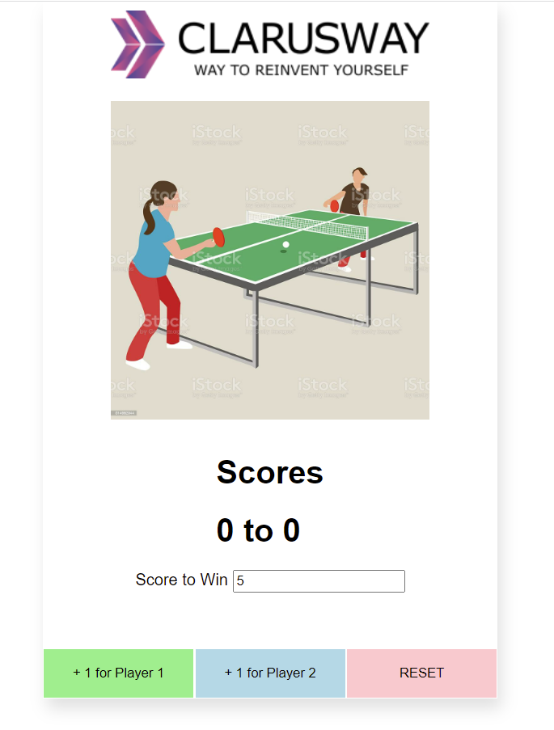
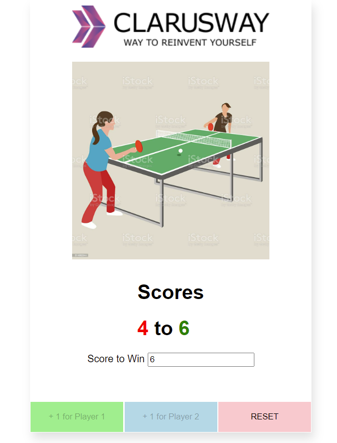

#  :tennis: Ping-Pong-Score-Keeper :raising_hand:
> Ping Pong score keeper add has score area for two players. You arrange the winning point then players click on their buttons. You can also reset te game.

## Table of contents
  - [Table of contents](#table-of-contents)
  - [General info](#general-info)
  - [Technologies](#technologies)
  - [Features](#features)
  - [How to use](#how-to-use)
  - [Screenshots](#screenshots)
  - [Contact](#contact)

## General info
This project is created to sharpen the use of event listeners in JavaScript. It is one ofe the three projects of Project Week of The Clarusway IT School.

## Technologies
* HTML
* CSS
* JavaScript

## Features
* Gives out put according to clicks on buttons for two players,
* takes the winning point,
* reset the game, 
* and at the end of the game make the winner green and the loser red...

## How to use
Click on this [link](https://i-bilge.github.io/Ping-Pong-Score-Keeper/)

## Screenshots

## Contact
:mailbox_with_mail: You can send me email : iismailbilge@gmail.com :mailbox_with_mail:
